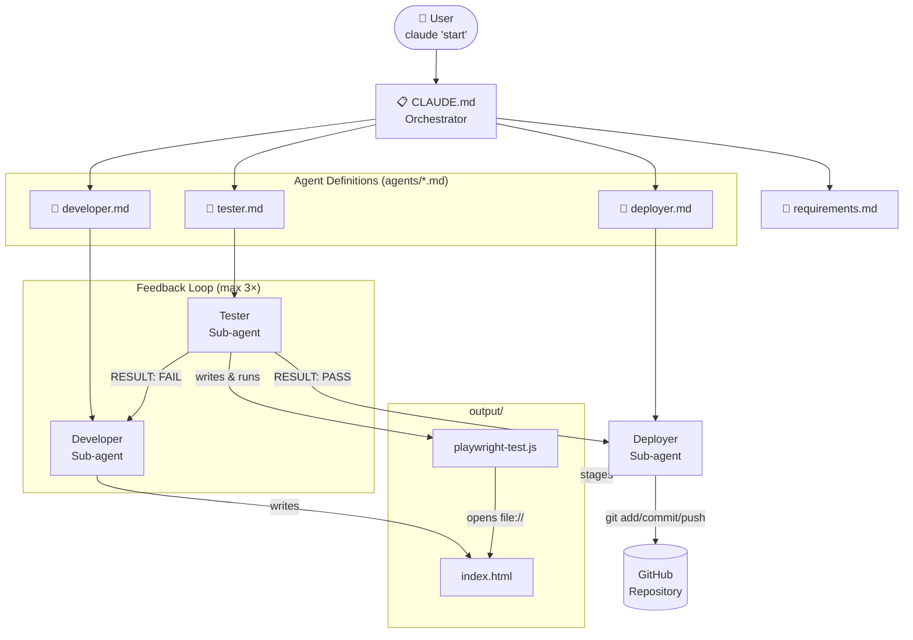

# Architecture



## Components

| File | Role |
|------|------|
| `CLAUDE.md` | Orchestrator — auto-loaded by Claude Code, drives the full workflow |
| `requirements.md` | Input — describes what to build |
| `agents/developer.md` | Developer agent persona — writes implementation files |
| `agents/tester.md` | Tester agent persona — runs Playwright visual tests |
| `agents/deployer.md` | Deployer agent persona — commits and pushes to GitHub |
| `output/index.html` | Generated implementation |
| `output/playwright-test.js` | Generated test script |
| `.claude/settings.json` | Pre-approved tool permissions for non-interactive runs |

## Running

```bash
# Full workflow (developer → tester → deployer)
claude "start"

# Deploy only (when output already exists)
claude "Read agents/deployer.md and run the deployer agent to commit and push the project."

# Non-interactive CI mode
GITHUB_REMOTE_URL=https://github.com/user/repo.git claude --print --dangerously-skip-permissions "start"
```
